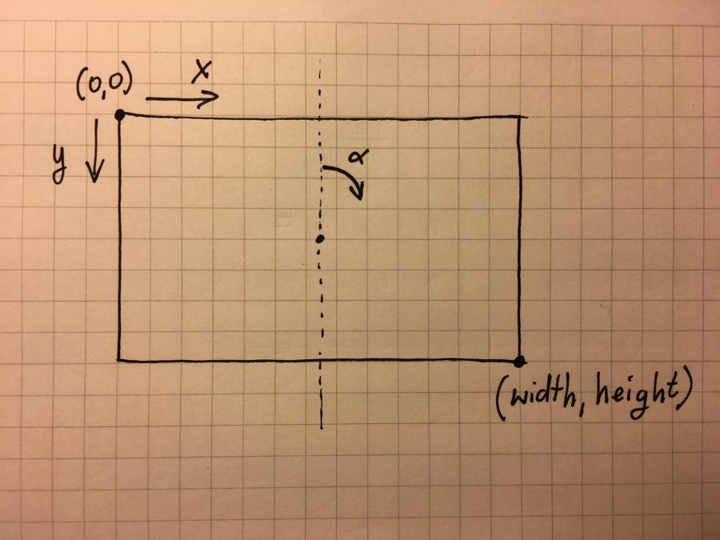

## RectanglePrison

Script finds an intersection point of a line with one of the sides of a rectangle. The line is defined as follows:

- it starts at the `(x0, y0)` point
- it heads in a direction described by the given `angle` (from 0 to 360 degrees)

The rectangle is described by its width and height

Coordinate system definition:

## How to use

1. First install `node.js` on your machine. See: [https://nodejs.org](https://nodejs.org/)

2. go to the `RectanglePrison` directory in your terminal and call:
	
		npm install
		
3. To see usage information please call:

		node rectangleprison.js --help

	Output:

		Usage: rectangleprison [options]
		
		Options:
	
		-h, --help     output usage information
	    -V, --version  output the version number
	    --width <n>    width of the rectangle
	    --height <n>   heigth of the rectangle
	    -x, --x0 <n>   x coordinate of the start point
	    -y, --y0 <n>   y coordinate of the start point
	    --angle <n>    angle in degrees at which the line heads
    
4. Example launch from the terminal:
	
		node rectangleprison --height 10 --width 10 -x 5 -y 5 --angle 20
	
	Output:
	
		Line function: y = -2.7474774194546208x + 18.737387097273103
		Found intersection with: top side
		Intersection point: (6.819851171331012,10)